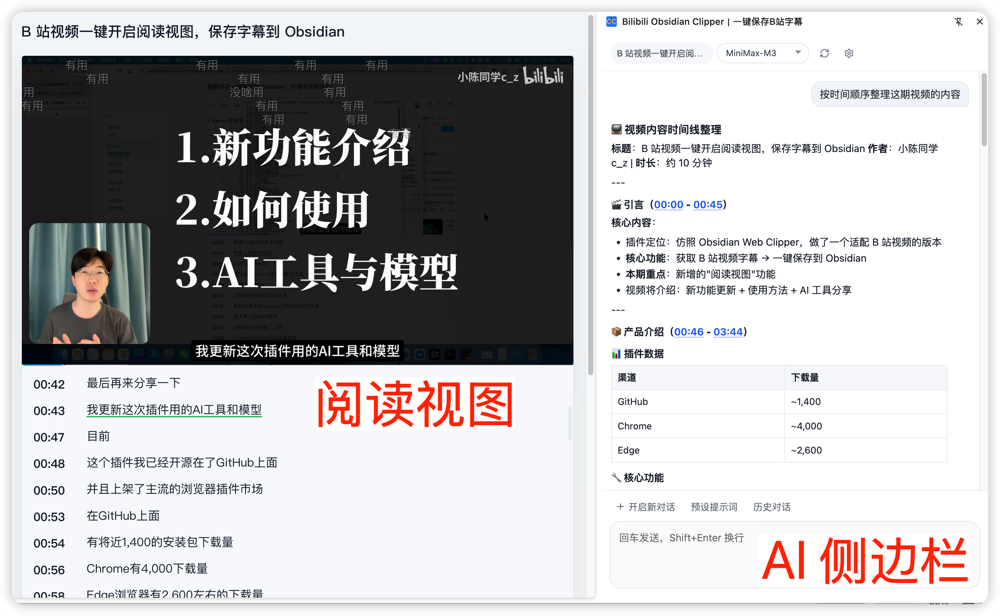
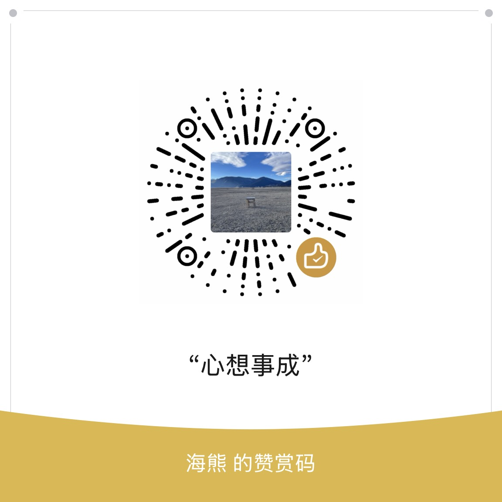

# Bilibili Obsidian Clipper｜一键保存B站字幕

推荐官方插件市场下载：[Chrome](https://chromewebstore.google.com/detail/jokophbofiphenlplmohabdcmalcbenl?utm_source=item-share-cb) · [Edge](https://microsoftedge.microsoft.com/addons/detail/fbeeapnjdjgacilaobonekidbfjcmdjo) · [Firefox](https://addons.mozilla.org/addon/bilibili-obsidian-clipper/)

在 B 站视频页抓取字幕，预览后可复制 Markdown、下载字幕文件，并一键写入 Obsidian（Local REST API）。

> 注意：仅支持获取“有字幕轨”的 B 站视频字幕（播放器里有「字幕」选项，通常表示作者上传了外挂字幕或平台提供了 AI 字幕）；没有字幕轨的视频无法获取字幕。

## 功能

- B 站视频字幕抓取（自动识别当前分 P）
- 字幕预览、复制 Markdown
- 下载字幕文件（`srt/txt`）
- 保存到 Obsidian（Local REST API）

### 阅读视图（v1.0.18+）

沉浸式布局，支持排版调整、主题切换、字幕同步等。

> 稍后再看页面的阅读视图体验尚不完善，推荐在普通视频页使用。

### AI 侧边栏（v1.1.0+）

支持围绕当前视频字幕进行轻量对话，也可在普通网页中作为通用 AI 对话侧边栏使用。

内置历史对话、预设提示词、模型切换等能力，适合快速总结、整理与提炼视频内容。

## 功能图片演示

## 安装方式

### 升级说明

- Chrome / Edge：如果是从 GitHub 手动下载安装包升级，建议直接替换原扩展目录中的文件，并在扩展管理页点击“重新加载”；不要先移除旧扩展，否则本地设置、AI 历史对话和已保存的 Key 可能会丢失。
- Firefox：当前为“临时加载附加组件”方式，更适合开发调试使用；重新移除并加载新版本后，本地设置和 AI 历史对话可能不会保留。

### Chrome / Edge

1. 在 GitHub 的 `Releases` 页面下载最新的 `*-chrome.zip` 包
2. 解压到任意本地目录
3. 打开扩展管理页：
   - Chrome：`chrome://extensions/`
   - Edge：`edge://extensions/`
4. 开启"开发者模式"
5. 点击"加载已解压的扩展程序"
6. 选择解压后的扩展目录

### Firefox

1. 在 GitHub 的 `Releases` 页面下载最新的 `*-firefox.zip` 包
2. 解压到任意本地目录
3. 打开 Firefox 附加组件管理页：`about:addons`
4. 点击右上角齿轮图标 → "调试附加组件"
5. 点击"临时加载附加组件..."
6. 选择解压后的文件夹中的 `manifest.json` 文件

## 项目结构

- `README.md` / `LICENSE`：项目说明与许可证
- `extension/`：插件源码（manifest、js、css、icons）

## Obsidian 配置

1. 在 Obsidian 社区插件市场安装并启用 `Local REST API with MCP`
2. 在插件设置中勾选 `Enable Non-encrypted (HTTP) Server`
3. 复制插件页面里的 API Key
4. 在扩展设置页填写 `Local REST API 地址`、`API Key`、`笔记目录`

## 使用方式

1. 打开任意 B 站视频页并点击扩展图标
2. 面板会自动抓取并展示字幕
3. 按需点击 `刷新 / 复制 / 下载 / 保存到 Obsidian`

## 视频教程

- [B 站教程](https://www.bilibili.com/video/BV15qQwB4EZ9/?spm_id_from=333.1387.homepage.video_card.click&vd_source=040bc5ea7866b419558ec2682a2ccb59)

## 支持开发者

如果这个项目对您有帮助，欢迎微信打赏支持我的开发工作。您的支持是我持续改进和维护这个项目的动力。

## 免责声明

> ▎ **用户自负责任条款**：本工具仅在用户已登录 B 站、且有访问权限的前提下获取数据。所有数据通过用户自己的浏览器和 cookie 获取，不经过任何第三方服务器。本工具不存储、不分发任何 B 站内容。使用本工具产生的所有后果由用户自行承担。请遵守 B 站用户协议与相关法律法规。
