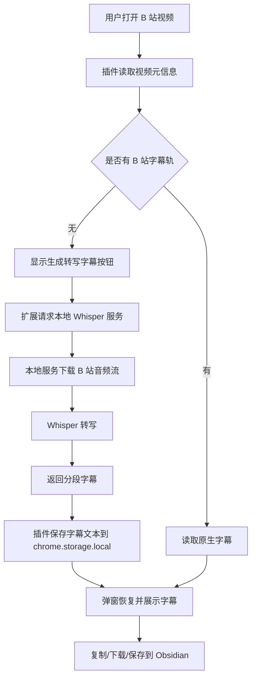

# Bilibili Obsidian Clipper 无字幕视频转写功能技术说明

## 1. 背景与问题发现

原项目 `Bilibili-Obsidian-Clipper` 的核心能力是读取 B 站播放器已有的字幕轨，并将字幕内容整理后复制、下载或保存到 Obsidian。这个能力对“播放器里存在字幕选项”的视频有效，包括作者上传字幕和平台 AI 字幕。

本次需求的缺口是：很多 B 站视频没有字幕轨。原插件在这类视频上只能提示“暂无字幕”或“抓取失败”，无法继续生成可保存到 Obsidian 的字幕内容。

经过分析后，问题被拆成几类：

1. B 站没有字幕轨时，接口中没有可直接读取的字幕 JSON。
2. 要生成字幕，必须先获得视频音频流，再交给语音识别模型转写。
3. Chrome 扩展本身不能直接调用本机命令行程序，也不能直接启动本地 Python/Whisper 进程。
4. B 站音频地址存在防盗链和 403 问题，直接由扩展下载音频不稳定。
5. 转写耗时较长，如果每次打开插件都重新转写，体验不可接受。
6. 保存到 Obsidian 需要验证真实写入，不能只根据 HTTP PUT 成功就认为保存完成。

## 2. 最终技术路线

最终采用“Chrome 扩展 + 本地 Whisper 服务”的方案：



这个方案没有默认保存视频画面，也不默认长期保存音频。默认行为是：

```text
首次生成转写字幕 -> 临时获取音频 -> Whisper 转写 -> 保存字幕文本到 chrome.storage.local -> 临时音频删除 -> 下次打开直接恢复字幕
```

## 3. 主要实现内容

### 3.1 扩展清单与权限

修改文件：`extension/manifest.json`

主要变化：

- 将本地开发版本标识为 `Bilibili Obsidian Clipper Local Transcribe`。
- 增加 B 站音频相关域名权限，例如 `bilivideo.com`。
- 增加访问本地服务的权限，例如 `http://127.0.0.1/*`、`http://localhost/*`。

这些权限用于：

- 读取 B 站视频信息和字幕信息。
- 请求本地 Whisper-compatible 服务。
- 与 Obsidian Local REST API 通信。

### 3.2 后台脚本能力

修改文件：`extension/background.js`

新增或增强了以下能力：

1. **无字幕转写入口**
   - 新增消息：`generate-transcription-subtitle`
   - 根据 `bvid`、`cid`、`aid`、视频时长等信息生成转写请求。

2. **B 站音频候选提取**
   - 调用 B 站 `playurl` 接口获取 DASH audio 信息。
   - 提取 `baseUrl` 和 `backupUrl`，按可用候选逐个尝试。

3. **本地 Whisper 服务适配**
   - 当 Whisper Base URL 是 `127.0.0.1` 或 `localhost` 时，扩展不再自己下载 `bilivideo.com` 音频。
   - 改为把音频候选 URL 发送给本地服务，由本地服务负责下载和转写。
   - 这样可以绕开浏览器扩展 fetch 音频时容易遇到的 403 问题。

4. **远程 Whisper-compatible API 兼容**
   - 如果不是本地服务，则保留直接上传音频 Blob 到 `/audio/transcriptions` 的路径。
   - 支持 `model`、`language`、`response_format=verbose_json`。

5. **FFmpeg 预处理能力预留**
   - 支持配置 FFmpeg 服务地址和输出格式。
   - 当前推荐默认关闭，只有需要格式转换或压缩时再启用。

6. **Obsidian 写入校验**
   - 原来只要 PUT 成功就提示成功。
   - 现在写入后会再 GET 同一路径，比较返回内容是否与待保存内容一致。
   - 如果校验失败，会返回明确错误，避免“显示成功但 Obsidian 没有文件”的误判。

7. **字幕缓存管理消息**
   - 新增 `subtitle-cache-stats`：统计字幕缓存数量。
   - 新增 `subtitle-cache-clear`：清理字幕缓存。
   - 只清理 `boc_subtitle_cache_` 前缀，不会清理 API Key、Obsidian 配置和 AI 配置。

### 3.3 内容脚本能力

修改文件：`extension/content.js`

主要实现：

1. **识别无字幕轨状态**
   - 当 B 站接口没有返回可用字幕轨时，不再直接终止流程。
   - 前端显示“暂无字幕”并提供“生成转写字幕”按钮。

2. **生成转写字幕**
   - 点击按钮后发送 `generate-transcription-subtitle` 到后台。
   - 后台返回 Whisper 转写后的分段字幕。
   - 内容脚本将转写结果注入为一个虚拟字幕轨，标记为 `generated-asr`。

3. **转写字幕缓存**
   - 转写成功后保存到 `chrome.storage.local`。
   - key 格式类似：

     ```text
     boc_subtitle_cache_generated_<bvid>_<cid>_<provider>_<model>_<language>
     ```

   - 下次打开同一视频时，插件先查 `chrome.storage.local`。
   - 如果命中缓存，直接恢复字幕，不再下载音频，也不再调用 Whisper。

4. **缓存恢复状态提示**
   - 命中缓存时，弹窗显示“已从缓存恢复转写字幕”。
   - 用户可以直接复制、下载或保存到 Obsidian。

5. **删除本地音频缓存**
   - 如果用户开启了“保留转写音频缓存”，转写结果会带回本地音频路径。
   - 弹窗可以请求后台删除对应音频文件。
   - 默认不保留音频，因此通常不需要这个按钮。

### 3.4 弹窗 UI

修改文件：

- `extension/popup.html`
- `extension/popup.js`
- `extension/popup.css`

主要变化：

1. 增加“生成转写字幕”按钮。
2. 对生成过程显示状态和进度提示。
3. 转写完成后按钮变为“重新生成转写”。
4. 如果命中字幕文本缓存，直接显示转写字幕，不再重新生成。
5. 支持删除本地音频缓存按钮，但只有存在本地音频路径时才显示。
6. 修复按钮过大的 UI 问题，将“重新生成转写”改为小按钮。
7. 修复弹窗每次打开都强制刷新导致缓存字幕被覆盖的问题。

### 3.5 设置页

修改文件：

- `extension/options.html`
- `extension/options.js`
- `extension/options.css`

新增配置项：

1. 是否启用无字幕轨转写。
2. Whisper-compatible Base URL。
3. Whisper 模型名。
4. Whisper API Key。
5. 默认语言。
6. 最大视频时长。
7. 是否保留转写音频缓存。
8. 音频缓存目录。
9. 是否启用 FFmpeg 预处理。
10. FFmpeg 服务地址。
11. FFmpeg 输出格式。

新增“字幕缓存管理”：

- 显示转写字幕缓存数量。
- 显示全部字幕缓存数量。
- 支持清理转写字幕缓存。
- 支持清理全部字幕缓存。
- 支持刷新数量。

这里清理的是 Chrome 扩展内部的字幕文本缓存，不会删除：

- Obsidian 笔记
- API Key
- AI 模型配置
- 本地音频文件

### 3.6 本地 Whisper 服务

新增文件：`scripts/local_whisper_server.py`

这个服务是本次方案的关键。它提供 OpenAI Whisper-compatible 风格接口，同时增加了 B 站专用接口。

主要接口：

```text
GET  /health
GET  /v1/models
POST /v1/audio/transcriptions
POST /v1/bilibili/transcriptions
POST /v1/bilibili/audio/delete
```

核心职责：

1. 接收扩展传来的 B 站音频候选 URL。
2. 使用接近浏览器请求的 headers 下载音频。
3. 将音频保存到临时目录。
4. 调用本地 `openai-whisper` 转写。
5. 返回 Whisper verbose JSON 风格结果。
6. 默认清理临时文件。
7. 如果显式开启音频缓存，则把音频保存到用户指定目录。
8. 提供删除本地音频缓存接口。

启动示例：

```powershell
cd E:\project\Obsidian-Clipper-Greater\Bilibili-Obsidian-Clipper
python scripts\local_whisper_server.py --model tiny --language zh
```

如果需要更高准确率，可以换模型：

```powershell
python scripts\local_whisper_server.py --model small --language zh
```

### 3.7 转写结果归一化

新增文件：`extension/transcription/normalize.js`

用途：

- 兼容 Whisper 返回的 `segments`。
- 兼容只有 `text` 的返回。
- 转换为插件内部统一使用的字幕分段结构。
- 保证弹窗预览、下载、保存 Obsidian 使用同一份字幕结构。

测试文件：`scripts/tests/transcription_normalize.test.mjs`

## 4. 关键问题与解决过程

### 4.1 是否必须下载完整视频

结论：不下载完整视频。

最初讨论时容易把“转写字幕”理解为“下载视频 -> 提取音频 -> Whisper”。后来明确优化为：

- 不保存视频画面。
- 默认只临时下载音频流。
- 转写完成后删除临时音频。
- 只把字幕文本缓存到 `chrome.storage.local`。

这符合用户目标：只需要字幕，不需要本地保存视频或音频。

### 4.2 浏览器扩展直接下载 B 站音频遇到 403

现象：

```text
音频下载失败：upos-xxx.bilivideo.com: HTTP 403
```

原因：B 站音频 CDN 对 headers、referer、cookie、防盗链策略较敏感。Chrome 扩展直接 fetch 某些音频地址不稳定。

解决：

- 扩展只负责获取音频候选 URL。
- 把 URL 传给本地 Python 服务。
- 本地服务模拟更接近浏览器的请求头下载音频。
- 端到端测试证明本地服务可成功下载并转写。

### 4.3 `result is not defined` 导致有字幕和无字幕视频都失败

现象：插件弹窗显示：

```text
抓取失败：result is not defined
```

原因：普通抓取路径中误用了只属于转写路径的 `result` 变量，导致所有视频初始化时都可能报错。

解决：

- 移除普通元信息构造中错误引用的 `result.audioPath`。
- 只在转写完成后的缓存对象中写入 `audioPath`。
- 重新测试有字幕和无字幕视频流程。

### 4.4 `DEFAULT_SETTINGS has already been declared`

现象：Chrome 扩展错误页出现：

```text
Uncaught SyntaxError: Identifier 'DEFAULT_SETTINGS' has already been declared
```

原因：扩展更新或手动注入 content script 后，旧页面中已经存在同名顶层常量，再次注入同一个脚本会触发重复声明。

解决：

- 后台和弹窗对这个错误做兼容处理。
- 如果脚本版本不一致，提示刷新当前 B 站页面。
- 操作建议：更新扩展后刷新 B 站视频页，避免旧 content script 残留。

### 4.5 Obsidian 显示保存成功但实际没看到文件

现象：弹窗提示保存成功，但 Obsidian 中未找到对应笔记。

原因可能包括：

- 写入目录和用户查看目录不一致。
- Local REST API PUT 返回成功但实际内容未按预期落库。
- 用户配置的 `noteFolder` 与 Obsidian 当前侧边栏路径理解不一致。

解决：

- 写入后立即 GET 同一路径。
- 比较返回内容和待保存内容。
- 不一致则返回错误，不再给出误导性成功提示。

### 4.6 转写完成后切换页面又要重新生成

问题：转写过程耗时，如果每次打开弹窗都重新转写，体验非常差。

解决：

- 转写成功后把字幕文本写入 `chrome.storage.local`。
- 下次打开同一 `bvid + cid + provider + model + language` 的视频时优先恢复缓存。
- 只有用户点击“重新生成转写”才重新调用 Whisper。

### 4.7 音频缓存与字幕缓存的区别

最终明确为两种完全不同的缓存：

| 类型 | 位置 | 默认启用 | 用途 |
| --- | --- | --- | --- |
| 字幕文本缓存 | `chrome.storage.local` | 是 | 避免重复转写 |
| 音频缓存 | 用户指定目录，如 `E:\yyy\videocache\BilibiliAudioCache` | 否 | 调试、复查、手动复用 |

对当前用户需求来说，音频缓存不是必需的。只要字幕文本缓存存在，就能避免重复转写。

### 4.8 Chrome Application 面板看不到 `chrome.storage.local`

现象：DevTools 的 Application 面板显示“未检测到扩展存储空间”。

原因：Chrome 对扩展存储的 UI 展示不稳定，尤其在 `chrome://extensions` 页面本身打开 DevTools 时，看的不是扩展运行上下文。

确认方式：在扩展自己的 `options.html` 或 Service Worker DevTools Console 中执行：

```js
chrome.storage.local.get(null).then(console.log)
```

查看转写缓存 key：

```js
chrome.storage.local.get(null).then(data => {
  console.log(Object.keys(data).filter(k => k.startsWith("boc_subtitle_cache_generated_")));
});
```

### 4.9 字幕缓存过多如何清理

最初没有 UI 清理入口，只能通过 Console 手动执行 `chrome.storage.local.remove(...)`。

现已补充设置页“字幕缓存管理”：

- 清理转写字幕缓存：只删除 `boc_subtitle_cache_generated_`。
- 清理全部字幕缓存：删除所有 `boc_subtitle_cache_`。
- 不使用 `chrome.storage.local.clear()`，避免误删 API Key 和插件配置。

## 5. 当前使用流程

### 5.1 安装本地扩展

1. 打开 Chrome：`chrome://extensions/`
2. 开启“开发者模式”。
3. 点击“加载已解压的扩展程序”。
4. 选择目录：

```text
E:\project\Obsidian-Clipper-Greater\Bilibili-Obsidian-Clipper\extension
```

5. 如果同时安装了原版商店扩展，建议禁用原版，避免两个扩展同时注入。

### 5.2 启动本地 Whisper 服务

```powershell
cd E:\project\Obsidian-Clipper-Greater\Bilibili-Obsidian-Clipper
python scripts\local_whisper_server.py --model tiny --language zh
```

默认地址：

```text
http://127.0.0.1:8765/v1
```

停止服务：

- 如果是前台运行，按 `Ctrl+C`。
- 如果是后台进程，可使用：

```powershell
$pid = (Get-NetTCPConnection -LocalPort 8765 -State Listen).OwningProcess
Stop-Process -Id $pid -Force
```

### 5.3 插件设置推荐

推荐设置：

```text
启用无字幕轨转写：开启
Whisper-compatible Base URL：http://127.0.0.1:8765/v1
Whisper 模型名：whisper-1
默认语言：zh
最大视频时长：3600
保留转写音频缓存：关闭
FFmpeg 预处理：关闭
```

说明：

- `whisper-1` 在这里是兼容接口里的模型名，不代表必须调用 OpenAI API。
- 实际本地使用哪个 Whisper 模型，由启动本地服务时的 `--model tiny/small/...` 决定。

### 5.4 无字幕视频使用流程

1. 打开 B 站视频。
2. 点击扩展图标。
3. 如果没有字幕轨，会出现“生成转写字幕”。
4. 点击后等待本地 Whisper 转写。
5. 转写完成后可以复制、下载、阅读或保存到 Obsidian。
6. 下次打开同一视频，会优先从 `chrome.storage.local` 恢复字幕。

## 6. 验证情况

已做过的验证包括：

1. 本地 Whisper 服务可启动。
2. CUDA 版 PyTorch 可用，GPU 为 NVIDIA GeForce RTX 4060 Laptop GPU。
3. 本地服务可对 B 站视频执行端到端音频下载和 Whisper 转写。
4. 无字幕视频可以生成转写字幕。
5. 转写字幕可写入 `chrome.storage.local`。
6. 再次打开同一视频可从缓存恢复转写字幕。
7. 音频缓存默认不保留。
8. 开启保留音频缓存时，只保存音频流文件，不保存完整视频画面。
9. Obsidian 写入增加了写后 GET 校验。
10. 设置页新增缓存统计和清理入口。

已执行的静态检查：

```powershell
node --check extension\background.js
node --check extension\options.js
node --check extension\content.js
node --check extension\popup.js
git diff --check -- extension/background.js extension/options.html extension/options.js extension/options.css
```

## 7. 当前限制

1. **仍需手动启动本地 Whisper 服务**

   Chrome 扩展不能直接启动本地 Python 进程。这是浏览器安全限制，不是代码实现问题。

2. **自动启动 Whisper 需要额外架构**

   可选方向：

   - Native Messaging Host
   - 常驻本地 launcher 服务
   - 桌面客户端托管 Whisper 服务

   当前未实现，因为会增加安装复杂度和系统权限配置。

3. **Application 面板未必显示扩展存储键值**

   可靠查看方式仍是扩展 DevTools Console 中执行 `chrome.storage.local.get(null)`。

4. **Whisper 模型越大越慢，占用 GPU/CPU 越高**

   `tiny` 快但准确率较低；`small` 准确率更好但耗时更高。

5. **长视频转写耗时明显**

   已有最大时长限制，避免误点超长视频导致长时间占用资源。

## 8. 后续优化建议

### 8.1 自动启动/停止 Whisper 服务

可以考虑 Native Messaging Host，但需要额外安装原生宿主程序，并注册 Chrome Native Messaging 配置。优点是用户点击“生成转写字幕”即可自动拉起服务；缺点是安装和维护复杂度明显增加。

建议优先级：中。

### 8.2 字幕缓存导入/导出

当前字幕缓存存在 Chrome 扩展内部。如果用户更换浏览器、重装扩展或清空扩展数据，缓存会丢失。

可考虑增加：

- 导出全部字幕缓存为 JSON。
- 从 JSON 导入字幕缓存。
- 按视频标题搜索缓存。

建议优先级：中高。

### 8.3 单视频缓存删除

当前设置页支持批量清理：转写缓存或全部字幕缓存。后续可以在弹窗中增加“删除当前视频字幕缓存”。

建议优先级：高。

### 8.4 更明确的缓存状态展示

弹窗可以进一步区分：

- 当前字幕来自 B 站原生字幕。
- 当前字幕来自 Whisper 新生成。
- 当前字幕来自本地字幕文本缓存。

建议优先级：中。

### 8.5 进度更细化

当前能提示正在生成和阶段性状态，但 Whisper 本身不容易实时返回逐段进度。后续可以让本地服务支持任务 ID 和轮询状态，例如：

```text
下载音频中 -> 转写中 -> 归一化中 -> 完成
```

建议优先级：中。

### 8.6 FFmpeg 服务整合

当前 FFmpeg 是可选外部预处理服务。后续可将 FFmpeg 调用直接集成到本地 Python 服务中，让音频下载、格式转换、转写都在同一个服务内完成。

建议优先级：中。

### 8.7 错误诊断面板

可以增加“诊断信息”按钮，一键显示：

- 当前扩展版本
- 当前视频 bvid/cid
- Whisper 服务健康状态
- 字幕缓存命中情况
- Obsidian API 连通情况

建议优先级：中。

## 9. 总结

本次开发把原项目从“只能抓取已有字幕轨”扩展为“没有字幕轨时可本地生成字幕”。核心设计是让 Chrome 扩展负责页面交互、视频元信息、字幕展示和 Obsidian 保存；让本地 Whisper 服务负责音频下载和语音识别。这样既保留了浏览器插件的轻量使用体验，又绕开了扩展直接处理本地模型和 B 站音频 403 的限制。

最终效果：

- 有字幕轨的视频继续走原生字幕抓取。
- 无字幕轨的视频可以通过本地 Whisper 生成字幕。
- 不保存完整视频画面。
- 默认不保留音频文件。
- 转写后的字幕文本会缓存到 `chrome.storage.local`，避免重复转写。
- 可在设置页查看和清理字幕缓存。
- 保存到 Obsidian 增加写后校验，降低误报成功的风险。